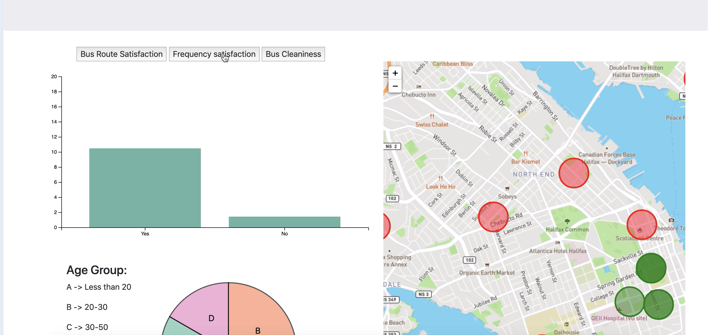
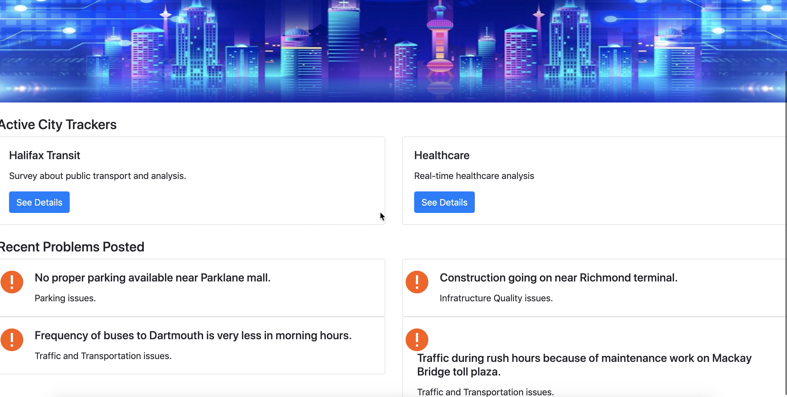

# MapsDataVisualization

Built a dashboard to visualize data on maps and graphs. Data fetched according to to current on-going topics from Twitter and Mobile Application Data.

Technologies Used:

1. Python
2. Mongo DB
3. NodeJs
4. D3 JS
5. Leaflet JS
6. Twitter API
7. HTML, CSS

###Screenshots

